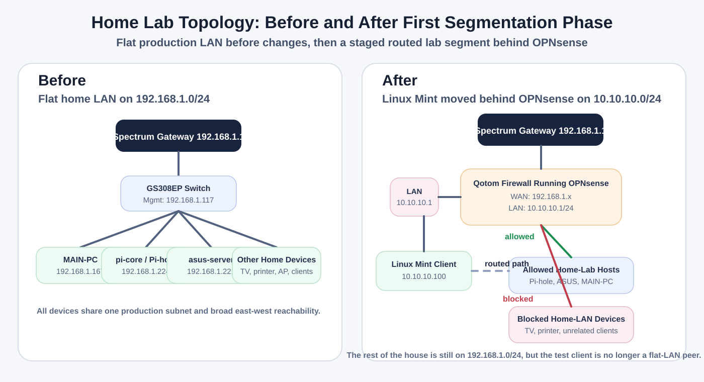

# Home Lab Network Segmentation

## 1. Project Overview

This repository documents my first real move away from a flat `192.168.1.0/24` home network and into a routed, policy-controlled lab segment behind a dedicated `Qotom` firewall running `OPNsense`.

This phase was not a full-house redesign. The milestone was narrower and more honest: move one Linux Mint test client off the flat LAN, place it behind `OPNsense` on `10.10.10.0/24`, and prove that it could still reach the systems I needed while losing broad peer-level access to the rest of the home network.

## 2. Why I Built This Lab

My starting network was practical but flat. That made it easy to get devices online, but it also meant lab systems, workstations, infrastructure, and unrelated home devices all lived in the same trust zone.

I built this lab to prove a safer migration path without pretending the whole environment had to change at once. I wanted to document a real troubleshooting sequence, not just a final diagram:

- establish a known-good baseline before touching the firewall
- bring up `OPNsense` behind the existing Spectrum router
- recover access safely when the management path was not where I expected
- remove stale firewall state before building anything new
- validate routing, DHCP, DNS, and selective access with evidence

## 3. Starting Network

The original production LAN was:

- subnet: `192.168.1.0/24`
- gateway: `192.168.1.1`
- `MAIN-PC`: `192.168.1.167`
- `asus-server`: `192.168.1.221`
- `pi-core` / Pi-hole: `192.168.1.224`
- Netgear GS308EP: `192.168.1.117`

At that point, the Linux Mint client was still just another peer on the same flat network.

## 4. Target Outcome for This Phase

The target for this phase was not "enterprise segmentation" and it was not "the whole house is on VLANs now."

The target was:

- keep the existing home network upstream and stable
- rebuild `OPNsense LAN` as `10.10.10.1/24`
- place the Linux Mint test client behind that firewall on `10.10.10.100/24`
- allow useful lab paths back to:
  - `pi-core`
  - `asus-server`
  - `MAIN-PC`
  - the internet
- block unrelated home-LAN devices that did not need to be reachable from the lab segment

## 5. Before/After Topology

The diagram shows the actual milestone for this repo:

- before: one flat `192.168.1.0/24` LAN
- after: a staged routed lab segment behind `OPNsense`, while the rest of the house still remains on the original network

## 6. Lab Story / Troubleshooting Narrative

### Problem

I wanted to stop treating the Linux Mint lab client as a flat-LAN peer without risking the rest of the home network during the first attempt.

### Starting Point

Before I changed anything, I documented the existing IP configuration, baseline connectivity, ARP visibility, and device discovery on the flat LAN. That mattered because once I started changing firewall interfaces and DHCP behavior, I needed a clean record of what already worked.

Relevant evidence:

- baseline client state and reachability: [01](assets/screenshots/01-main-pc-current-ipconfig.png), [02](assets/screenshots/02-main-pc-baseline-connectivity.png), [03](assets/screenshots/03-main-pc-arp-baseline.png)
- device discovery baseline: [04](assets/screenshots/04-current-lan-device-discovery-a.png), [05](assets/screenshots/05-current-lan-device-discovery-b.png), [06](assets/screenshots/06-current-lan-device-discovery-c.png)
- physical topology baseline: [07](assets/screenshots/07-current-switch-physical-port-map.png), [08](assets/screenshots/08-netgear-switch-management-access.png)

### What I Tried

I initially expected the `Qotom` firewall to be reachable from the existing production LAN after it was powered on and connected.

### What Failed

That assumption did not hold. Discovery attempts from the production side failed, which meant I needed to stop assuming the management plane was on the same side as the cable I could see plugged in.

Relevant evidence:

- failed discovery attempt: [09](assets/screenshots/09-qotom-ip-discovery-attempt.png)
- powered-on appliance and cabling context: [10](assets/screenshots/10-qotom-powered-on-physical-connections.png)
- recovery-side interface and lease context: [15](assets/screenshots/15-opnsense-interface-link-status.png)

### What I Found

The important finding was that the expected management path was not on the side of the firewall that already had the active upstream connection. The recovery work had to move to the `LAN` side instead of assuming the production-side cable would expose the GUI.

That changed the problem from "find the right management IP on the production LAN" to "get to the correct interface safely."

### Fix / Change Made

I did not plug the `OPNsense LAN` directly into the production switch just to regain access. Instead, I used Linux Mint with a USB-to-Ethernet adapter and connected directly to the Qotom `LAN` port. That gave me an isolated management path and reduced the risk of DHCP conflicts or accidental disruption on the live home LAN.

Relevant evidence:

- direct Linux Mint to Qotom `LAN`: [11](assets/screenshots/11-direct-linux-mint-to-qotom-lan.png)
- direct link state before useful DHCP: [12](assets/screenshots/12-linux-mint-direct-link-before-dhcp.png)

### Rollback Discipline

Before changing firewall state, I downloaded and renamed an `OPNsense` configuration backup. That was simple change-control discipline: document the state, create a rollback point, then proceed.

Relevant evidence:

- backup page: [13](assets/screenshots/13-opnsense-backup-page.png)
- renamed backup file: [14](assets/screenshots/14-opnsense-backup-file-renamed.png)

### Cleanup Before Rebuild

The firewall was not a clean slate. It still had leftover lab state, including `VLAN20_LAB` and old DHCP-related configuration. I kept that in the documentation because it explains why cleanup was part of the implementation, not an afterthought.

Relevant evidence:

- stale VLAN device: [16](assets/screenshots/16-opnsense-old-vlan-device.png)
- interface assignments before cleanup: [17](assets/screenshots/17-opnsense-interface-assignments-before-cleanup.png)
- VLAN removed: [19](assets/screenshots/19-opnsense-vlan-device-removed.png)
- Kea initially disabled: [20](assets/screenshots/20-opnsense-kea-disabled.png)
- old DHCP-related range still present: [21](assets/screenshots/21-opnsense-dnsmasq-old-dhcp-range.png)

### Rebuild and Validation

I rebuilt `OPNsense LAN` as `10.10.10.1/24` and configured Kea DHCP for the `10.10.10.0/24` lab network. The intended DHCP pool was `10.10.10.100 - 10.10.10.199`, with upstream DNS design tied back to `pi-core` / `192.168.1.224`.

Relevant evidence:

- readdressed LAN interface: [18](assets/screenshots/18-opnsense-lan-readdressed-10-10-10-1.png)
- Kea enabled: [22](assets/screenshots/22-opnsense-kea-enabled-settings.png)
- DHCP scope and subnet details: [23](assets/screenshots/23-opnsense-kea-dhcp-lan-mgmt-subnet.png)

### What Failed Again

DHCP success did not mean the routed lab was finished. There was an intermediate failure where the client could reach `10.10.10.1` and `192.168.1.1`, but not yet the internet. That distinction mattered because it forced me to validate routing and outbound behavior separately from address assignment.

Relevant evidence:

- routing failure before fix: [24](assets/screenshots/24-opnsense-wan-routing-failure-before-fix.png)
- DHCP lease renewal on the new network: [25](assets/screenshots/25-opnsense-kea-dhcp-lease-renewal.png)

### Final Working State

After correcting the WAN-side policy, routing, and NAT issue, the routed path worked. The Linux Mint client now sat behind `OPNsense` instead of as a flat peer on `192.168.1.0/24`.

Relevant evidence:

- post-fix dashboard state: [26](assets/screenshots/26-opnsense-dashboard-post-fix.png)
- routed lab validation: [28](assets/screenshots/28-routed-lab-validation.png)

### Controlled Access Policy

The final goal was not total isolation from everything. It was selective access. I wanted the lab client to keep access to useful systems such as `pi-core`, `asus-server`, `MAIN-PC`, and the internet, while blocking unrelated home-LAN devices.

Relevant evidence:

- LAN firewall rules: [27](assets/screenshots/27-opnsense-lan-firewall-rules.png)
- service-level validation to allowed systems: [29](assets/screenshots/29-service-level-validation.png)
- blocked access to unrelated home devices: [30](assets/screenshots/30-blocked-home-lan-devices.png)

## 7. Final Validation

The final path for this phase was:

`Linux Mint 10.10.10.100 -> OPNsense LAN 10.10.10.1 -> OPNsense WAN -> Spectrum router 192.168.1.1 -> internet`

What this proves:

- the Linux Mint test client is no longer a flat peer on `192.168.1.0/24`
- it now lives behind `OPNsense` on `10.10.10.0/24`
- it reaches the old LAN only through firewall policy

## 8. What I Learned

- baseline evidence is not paperwork; it makes troubleshooting defensible
- safe management access matters more than speed when a firewall is not behaving as expected
- stale VLAN and DHCP state should be documented and removed before building a clean segment
- DHCP working is only one part of routing validation
- selective allow rules are a better first milestone than pretending full segmentation is already done

## 9. Current Limitations

- the entire home network is not fully VLAN-segmented yet
- the old `192.168.1.0/24` production LAN still exists as the upstream network
- this repo documents a successful first routed segment, not a finished network redesign

## 10. Next Steps

- define the first intentional VLAN and subnet plan beyond this initial lab segment
- map GS308EP access and trunk roles before moving more devices
- move devices one category at a time instead of attempting one large cutover
- keep reducing flat-LAN trust by replacing host-by-host exceptions with clearer network boundaries

## 11. Repository Layout

- `README.md`
  - high-level project story for recruiters, interviewers, and reviewers
- `docs/lab-walkthrough.md`
  - chronological technical case study of the lab build and troubleshooting sequence
- `docs/evidence-manifest.md`
  - screenshot-by-screenshot evidence map for images `01` through `30`
- `assets/diagrams/topology-before-after.svg`
  - before/after phase diagram for the flat LAN and first routed segment
- `assets/screenshots/`
  - curated evidence set supporting the write-up
