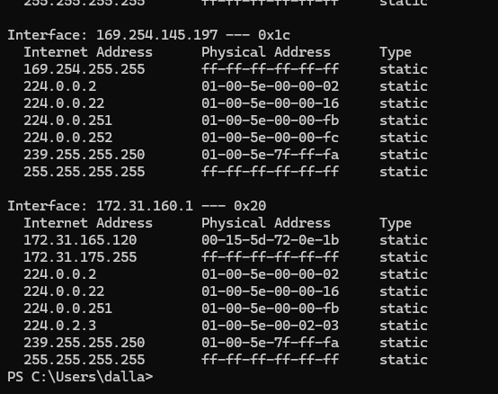
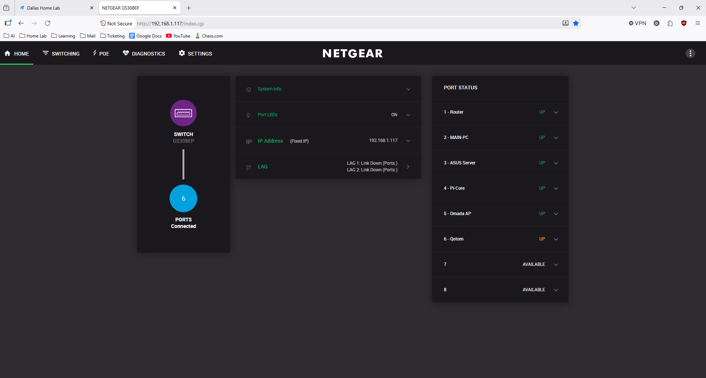
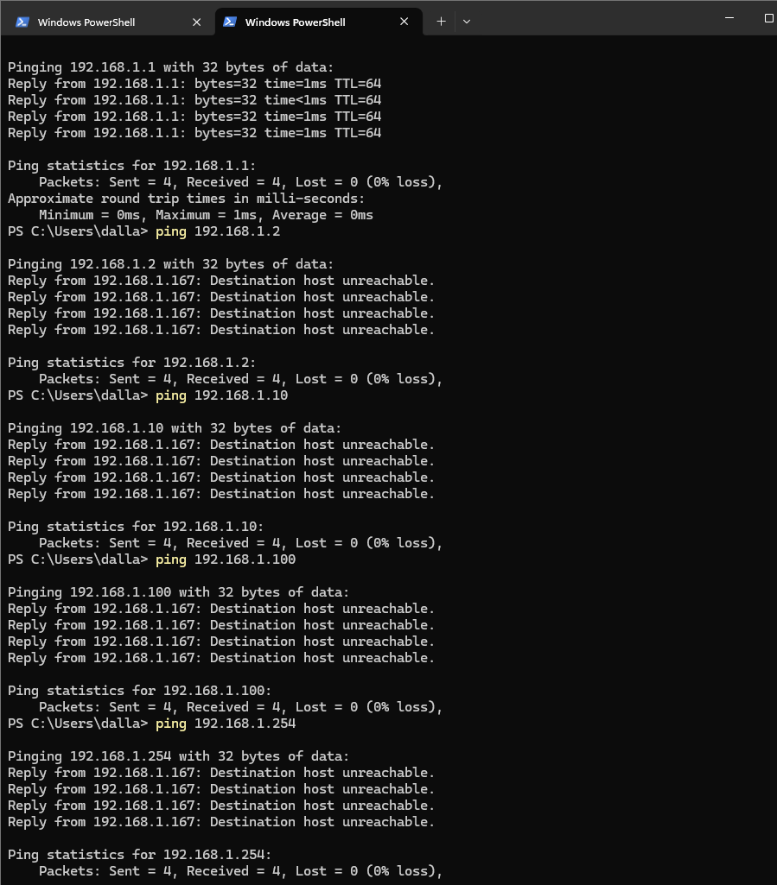
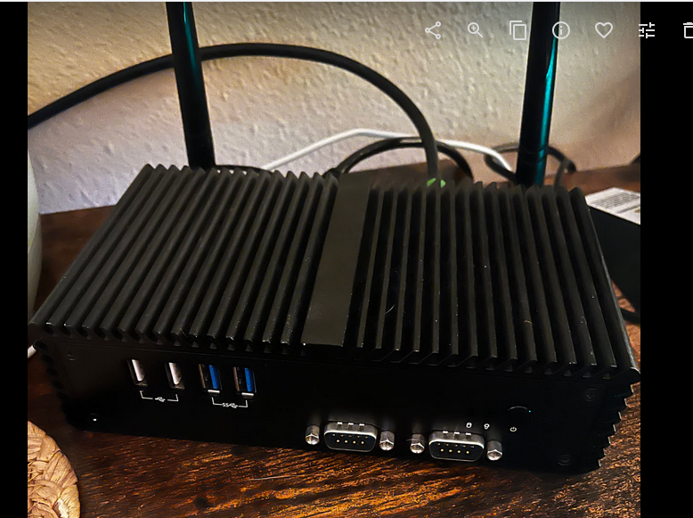
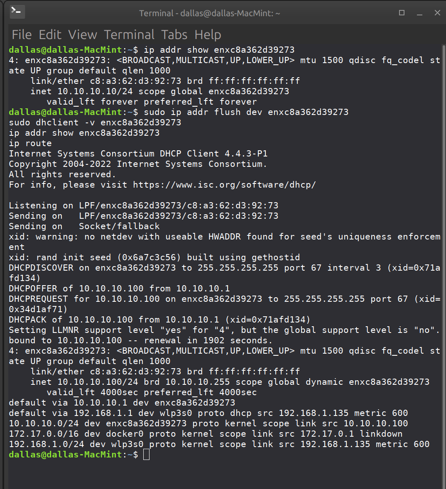
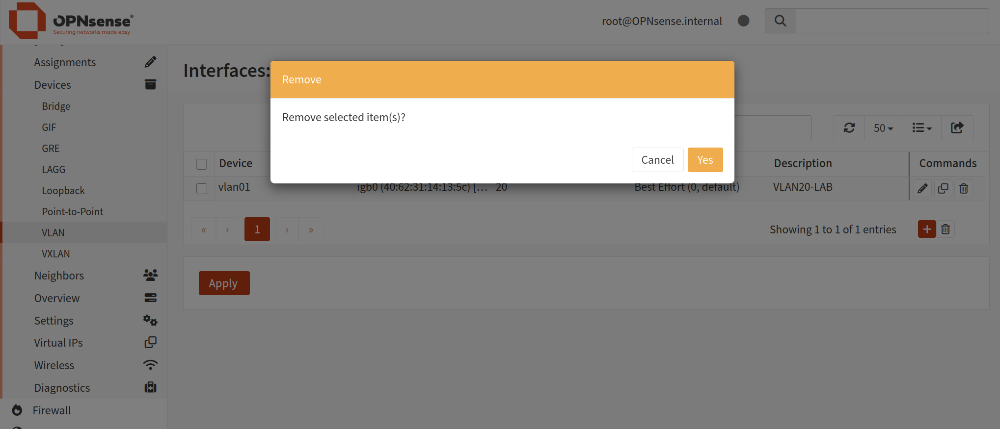
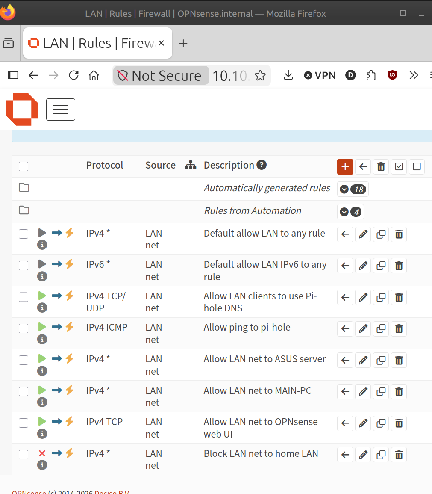

# Home Lab Network Segmentation

This lab documents the first transition away from a flat home network and into a routed, policy-controlled lab segment using `OPNsense` on a `Qotom` firewall appliance.

The starting point was a flat `192.168.1.0/24` LAN with:

- `MAIN-PC` on `192.168.1.167`
- `asus-server` on `192.168.1.221`
- `pi-core` / Pi-hole DNS on `192.168.1.224`
- Netgear GS308EP managed switch on `192.168.1.117`
- Spectrum gateway on `192.168.1.1`

The end state for this phase was:

- `OPNsense WAN` on the upstream home LAN
- `OPNsense LAN` moved to `10.10.10.1/24`
- Linux Mint test client on `10.10.10.100/24`
- DHCP served by OPNsense on `10.10.10.0/24`
- internet access working through OPNsense
- targeted access allowed to:
  - `pi-core` / Pi-hole
  - `asus-server`
  - `MAIN-PC`
- general access to other home-LAN devices blocked

This is not the final VLAN design for the whole house. It is the first successful routed and firewalled segment behind OPNsense.

## Why This Lab Matters

This repository shows:

- baseline documentation before making network changes
- staged firewall bring-up behind an existing ISP router
- safe rollback discipline with configuration backup
- interface troubleshooting between OPNsense LAN and WAN
- DHCP, NAT, DNS, and routing validation
- initial firewall policy that allows required lab resources while blocking unrelated home-LAN devices

## Final Outcome

From the Linux Mint client on the OPNsense LAN:

- `10.10.10.1` reachable
- `192.168.1.224` reachable
- `192.168.1.221` reachable
- `192.168.1.167` reachable
- internet reachable by IP and name
- random home-LAN devices such as the printer and TV not reachable

That means the client is no longer operating as a flat-LAN peer. It sits behind OPNsense on a separate routed subnet, with explicit access control back into the original home LAN.

## Evidence Highlights

### 1. Baseline Before Any Firewall Cutover

### 2. Existing Flat-LAN Device Visibility

### 3. Physical and Switch-Side Topology

### 4. OPNsense Discovery and Bring-Up

### 5. Cleanup and Rebuild of the Firewall Base

### 6. Controlled Access Rules and Validation

## Repository Layout

- `README.md`
  - high-level narrative and visual summary
- `docs/lab-walkthrough.md`
  - detailed step-by-step write-up from baseline discovery through routed-segment validation
- `docs/evidence-manifest.md`
  - screenshot inventory and what each image proves
- `assets/screenshots/`
  - curated evidence set used in the write-up

## Key Technical Decisions

- Kept the Spectrum router in front of OPNsense during the first phase
- Rebuilt the OPNsense LAN as `10.10.10.1/24` instead of staying on `192.168.1.0/24`
- Removed leftover `VLAN20_LAB` configuration before building the new foundation
- Used OPNsense Kea DHCP for the new lab subnet
- Kept access to `pi-core`, `asus-server`, and `MAIN-PC`
- Blocked broad access to the rest of `192.168.1.0/24`

## Next Steps

- convert the managed switch and AP to intentional VLAN-aware configuration
- create dedicated VLANs for:
  - management
  - trusted clients
  - servers
  - IoT
  - guest access
- migrate devices one class at a time instead of replacing the whole home LAN in one cutover

## Notes

- The OPNsense XML backup created during the lab was intentionally kept out of this repository.
- This repo documents a real home-lab transition, so some screenshots include private RFC1918 addressing and local hostnames.
