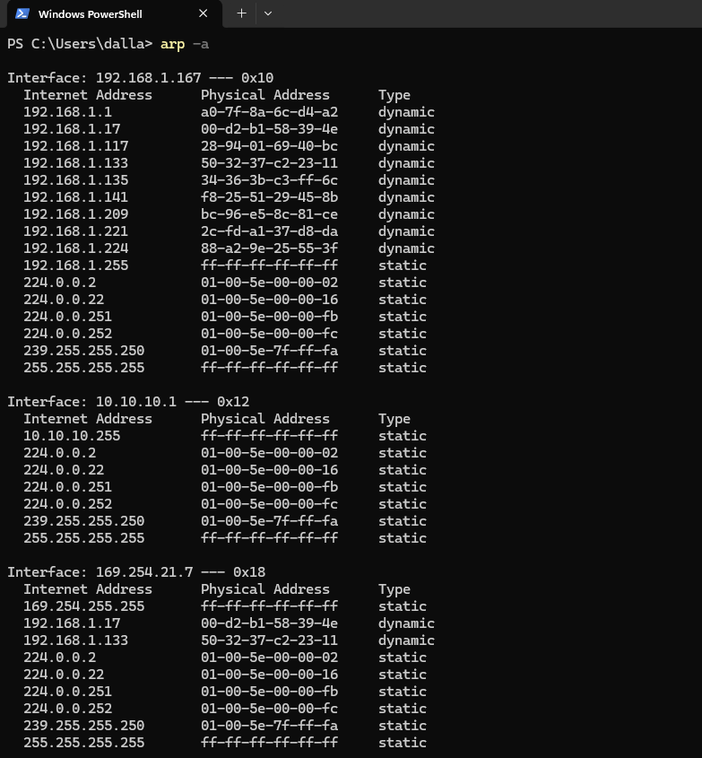
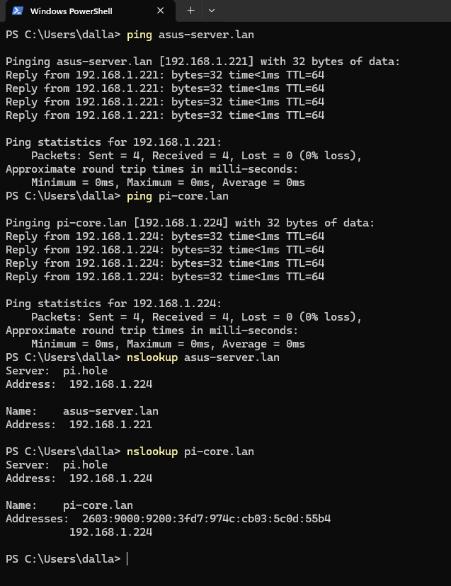

# Lab Walkthrough

## 1. Goal

The goal of this phase was to make a real first move away from a flat home network without overstating the result.

I was not trying to redesign the whole house in one session. I was trying to prove a smaller, more defensible milestone:

- keep the existing home LAN stable
- bring up `OPNsense` on a dedicated `Qotom` firewall
- move one Linux Mint test client behind that firewall onto `10.10.10.0/24`
- preserve access to the systems I actually needed
- block broad access to unrelated home-LAN devices

## 2. Phase 1: Baseline the Flat LAN

### Problem

Before changing firewall state, I needed a known-good record of the environment I was about to change.

### Starting Point

The original production LAN was:

- subnet: `192.168.1.0/24`
- gateway: `192.168.1.1`
- `MAIN-PC`: `192.168.1.167`
- `asus-server`: `192.168.1.221`
- `pi-core` / Pi-hole: `192.168.1.224`
- Netgear GS308EP: `192.168.1.117`

### What I Documented

I documented:

- current IP configuration on `MAIN-PC`
- gateway and DNS reachability
- internet reachability before any firewall change
- ARP visibility on the flat LAN
- local device discovery results

### Validation

- 
  - This proves `MAIN-PC` started on the original `192.168.1.0/24` LAN with the expected baseline addressing.
- 
  - This proves baseline connectivity worked before the segmentation work began.
- 
  - This proves shared ARP visibility on the flat LAN before any routing boundary existed.
- 
  - This proves initial device discovery results on the pre-change home LAN.
- 
  - This proves `asus-server` was visible and reachable on the original flat network.
- 
  - This proves `pi-core` was visible and reachable on the original flat network.

### What This Proves

Baseline documentation mattered because once I started changing interfaces, DHCP behavior, and routing, I needed a clean reference for what already worked and where each device already lived.

## 3. Phase 2: Document Physical Topology

### Problem

If I later ran into interface confusion, I needed a physical baseline, not just logical assumptions.

### What I Documented

I documented the switch cabling layout and switch management access before touching the firewall so I could troubleshoot from a known-good physical baseline.

Observed labeled cabling layout:

- Port 1: router
- Port 2: `MAIN-PC`
- Port 3: `asus-server`
- Port 4: `pi-core`
- Port 5: Omada AP
- Port 6: Qotom
- Ports 7-8: available

### Validation

- 
  - This proves the labeled physical switch layout I was working from before I touched the firewall.
- 
  - This proves the switch management plane was reachable and gave me a known-good topology reference.

### What This Proves

This was not just inventory. It gave me a defensible way to reason about later interface and cabling problems.

## 4. Phase 3: OPNsense Discovery Problem

### Problem

I expected the `Qotom` firewall to be reachable from the existing production LAN.

### What I Tried

I tried to discover and reach the firewall from the existing `192.168.1.0/24` network.

### What Failed

Discovery attempts failed. The expected management path was not where I thought it was.

### What I Found

The key finding was that the expected management path was not on the side of the firewall that already had the active upstream connection. I needed to recover the firewall from the `LAN` side instead of continuing to search the production LAN for the GUI.

### Validation

- 
  - This proves the production-side discovery attempt failed.
- 
  - This proves the appliance was powered on and physically connected while discovery was still failing.
- 
  - This captures additional recovery-side network state from the isolated management path after production-side discovery failed.

### What This Proves

The issue was not just "wrong IP." It was an interface-side access problem, and that changed how I needed to recover the firewall safely.

## 5. Phase 4: Safe LAN-Side Recovery

### Problem

I needed access to the firewall management side, but I did not want to create risk on the live home network while I was still figuring out interface state.

### Fix / Change Made

I used Linux Mint with a USB-to-Ethernet adapter and connected directly to the Qotom `LAN` port to create an isolated management path.

### Why I Chose This

I did not plug the OPNsense `LAN` directly into the production switch right away because that could have introduced DHCP conflicts or other disruption before I fully understood the appliance state.

### Validation

- 
  - This proves I used a direct Linux Mint to Qotom `LAN` connection as the isolated recovery path.
- 
  - This proves the direct link existed before the client had a useful DHCP result, which was part of the recovery sequence.

### What This Proves

This was the safer recovery path because it isolated management traffic from the production LAN while I was still stabilizing the firewall.

## 6. Phase 5: Backup Before Changes

### Problem

Once I had safe access, I needed a rollback point before changing interface, VLAN, or DHCP state.

### Fix / Change Made

I downloaded an `OPNsense` configuration backup and renamed it locally before I started rebuilding the firewall state.

### Validation

- 
  - This proves I captured the firewall configuration from the proper backup page before changing settings.
- 
  - This proves I preserved the backup locally as an intentional rollback artifact.

### What This Proves

This is simple but important change-control behavior: back up first, then edit.

## 7. Phase 6: Remove Stale Firewall State

### Problem

The firewall was not starting from a clean build. It still had leftover lab state, including `VLAN20_LAB` and stale DHCP-related configuration.

### What I Found

I documented the stale state instead of hiding it because it directly affected the rebuild:

- leftover `VLAN20_LAB`
- old interface assignments
- Kea not initially enabled
- old DHCP-related `Dnsmasq` range still present

### Fix / Change Made

I removed the stale VLAN device and cleaned up the old DHCP-related state before rebuilding the new lab subnet.

### Validation

- 
  - This proves the leftover `VLAN20_LAB` device existed before cleanup.
- 
  - This proves the old interface-assignment state was documented before I changed it.
- 
  - This proves the stale VLAN device was actually removed.
- 
  - This proves Kea DHCP was initially disabled when I assessed the stale state.
- 
  - This proves old DHCP-related configuration was still present and needed cleanup.

### What This Proves

Removing stale state mattered because building a new routed segment on top of mixed old VLAN and DHCP configuration would have made later results harder to trust.

## 8. Phase 7: Rebuild LAN on 10.10.10.0/24

### Goal

Rebuild the `LAN` side as a clean lab subnet behind `OPNsense`.

### Fix / Change Made

I readdressed `OPNsense LAN` to `10.10.10.1/24` and configured Kea DHCP for the new `10.10.10.0/24` lab network.

Key values for this phase:

- `OPNsense LAN`: `10.10.10.1/24`
- DHCP pool: `10.10.10.100 - 10.10.10.199`
- Linux Mint DHCP lease: `10.10.10.100/24`
- upstream DNS design: `pi-core` / `192.168.1.224`

### Validation

- 
  - This proves the LAN interface was rebuilt on `10.10.10.1/24`.
- 
  - This proves Kea DHCP was enabled for the new lab design.
- 
  - This proves the DHCP scope and subnet details for `10.10.10.0/24`.

### What This Proves

This was the actual segmentation foundation. Without this readdressing step, the client would still be a flat-LAN peer.

## 9. Phase 8: DHCP Success but Routing Failure

### Problem

Getting a DHCP lease from `OPNsense` did not mean the routed lab was fully working.

### What Failed

There was an intermediate failure where the client could reach:

- `10.10.10.1`
- `192.168.1.1`

but could not yet reach the internet.

### Why This Mattered

That intermediate failure was important evidence. It showed that DHCP, local gateway reachability, and full outbound routing/NAT were separate validation steps.

### Validation

- 
  - This proves there was a real intermediate routing failure before the lab worked end to end.
- 
  - This proves Linux Mint had already received a lease from the new OPNsense-managed subnet.

### What This Proves

DHCP success is not the same as a working routed segment.

## 10. Phase 9: Working Routed Segment

### Fix / Change Made

After correcting the WAN-side policy, routing, and NAT issue, the routed path worked.

### Final Path

`Linux Mint 10.10.10.100 -> OPNsense LAN 10.10.10.1 -> OPNsense WAN -> Spectrum router 192.168.1.1 -> internet`

### Validation

- 
  - This proves the firewall was in a post-fix working state after the routing problem was corrected.
- 
  - This proves the Linux Mint client had a working routed path from the new `10.10.10.0/24` network.

### What This Proves

At this point, the Linux Mint client was no longer operating as a flat peer on `192.168.1.0/24`.

## 11. Phase 10: Controlled Access Back to the Old LAN

### Problem

The goal was not total isolation from everything. The goal was selective access to useful systems while reducing unnecessary trust.

### Fix / Change Made

I applied firewall rules that preserved access to:

- `pi-core`
- `asus-server`
- `MAIN-PC`
- the internet

while blocking unrelated home-LAN devices that did not need to be reachable from the lab segment.

### Validation

- 
  - This proves the final LAN-side policy was selective, not open-ended.
- 
  - This proves the client could still reach useful lab services after the policy was applied.
- 
  - This proves access to specific unrelated home-LAN IPs was blocked from the lab client.

### What This Proves

This was the intended security outcome for the phase: preserve the paths I needed while removing broad peer-level access.

## 12. Final State

The accurate milestone for this repository is:

- the Linux Mint test client is no longer a flat peer on `192.168.1.0/24`
- it now lives behind `OPNsense` on `10.10.10.0/24`
- it reaches the old LAN only through firewall policy

The entire home network is not fully VLAN-segmented yet, and this repo does not claim that it is.

## 13. Lessons Learned

- documenting the baseline first made later troubleshooting easier to defend and explain
- physical topology documentation mattered because the first real problem was interface-side access, not just configuration
- direct LAN-side management was the safer recovery path compared to immediately plugging the firewall LAN into the production switch
- backing up the firewall before changes turned the rebuild into a controlled change instead of a one-way experiment
- documenting stale state made the cleanup step part of the engineering story instead of a hidden reset
- DHCP success needed separate validation from routing, NAT, and service access

## 14. Next Steps

- validate the next planned WAN and upstream assumptions before moving more devices
- define the first intentional VLAN and subnet design beyond this single staged segment
- map GS308EP access and trunk roles before expanding the topology
- move more devices one controlled path at a time instead of attempting one large cutover
